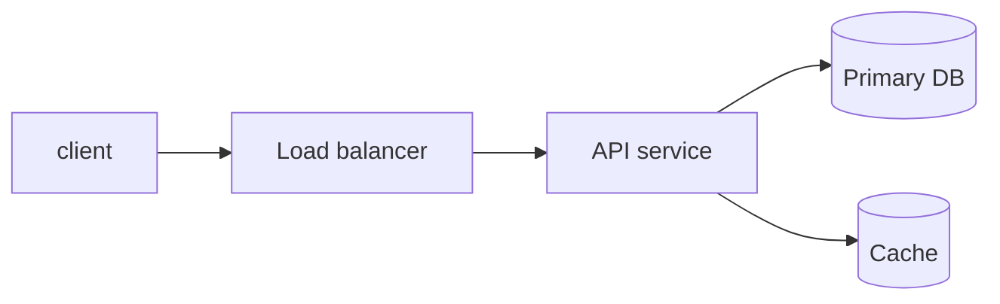

# {{Problem Name}}

> Status: draft / reviewed
> Date: YYYY-MM-DD
> Time spent: ~X min

This template follows the standard system-design interview arc. Each section is short on purpose — interviewers reward clarity, not volume. Fill the sections roughly in order, but it is normal to loop back (e.g., revise estimation after picking a data model).

Delete the italic guidance lines from your final writeup; they exist to remind you what each section is for.

---

## 1. Problem statement & clarifying questions

*Restate the problem in one or two sentences. Then list the clarifying questions you would ask the interviewer, with the assumed answer next to each one. The point of this section is to show you scope the problem before designing.*

**Problem:**

**Clarifying questions (Q → assumed A):**
- Q: ?
  A:
- Q: ?
  A:

---

## 2. Functional requirements

*What the system must DO. Bullet list, user-visible behavior. Keep it tight — 3 to 6 bullets. Mark anything you explicitly defer as "Out of scope".*

- [ ]
- [ ]

**Out of scope:**
-

---

## 3. Non-functional requirements

*The "-ilities" and numbers that shape the design. Without these, you cannot justify any architectural choice. State each as a target, not a wish.*

- **Scale:** users / QPS / data volume
- **Latency:** p50 / p99 targets for the critical path
- **Availability:** target (e.g., 99.9%)
- **Consistency:** strong / read-your-writes / eventual — and where
- **Durability:** can data be lost? for how long?
- **Read/write ratio:**

---

## 4. Capacity estimation (back-of-envelope)

*Numbers drive every later decision: do you need a cache? sharding? a CDN? Show the arithmetic; round aggressively. Powers of ten are fine.*

- DAU / MAU:
- Requests per second (peak ≈ 2–3× average):
- Storage per item × items/day × retention:
- Bandwidth (read QPS × payload size):
- Memory (working set for cache):

**Implications:** *one or two sentences — what do these numbers force?*

---

## 5. API design

*A small number of endpoints (or RPCs). For each: method, path, inputs, outputs, key error cases. Do not invent fields you will not use.*

```
POST /...
  body:    { ... }
  returns: { ... }
  errors:  4xx / 5xx scenarios
```

---

## 6. High-level architecture

*One diagram (Mermaid or ASCII) plus a short walkthrough of the request path for one read and one write. This is the centerpiece — most of the interview lives here.*



**Write path:**
1.

**Read path:**
1.

---

## 7. Data model

*Tables / collections / key schemas. Show only the fields that matter to the design. Note primary keys, indexes, and the partition/shard key if relevant.*

```
table url
  short_code   PK   varchar(7)
  long_url          text
  created_at        timestamp
  ...
```

---

## 8. Deep dives

*Pick 1–2 subsystems with the most interesting trade-offs and go one level deeper. This is where senior signal lives. Examples: ID generation strategy, cache invalidation, sharding scheme, hot-key handling, async pipeline, failure recovery.*

### 8.1 {{Topic}}
- Problem:
- Options considered:
- Choice + why:
- Failure modes:

---

## 9. Bottlenecks, trade-offs, and what would break first

*Where does this design fall over as load grows 10×? What did you trade away (consistency? cost? latency? simplicity?) to get here? A senior interviewer cares more about this than about the diagram itself.*

-

---

## 10. Follow-ups / what I would do with more time

*Honest list of things you skipped, deferred, or are unsure about. Better to name a gap than pretend it does not exist.*

-
