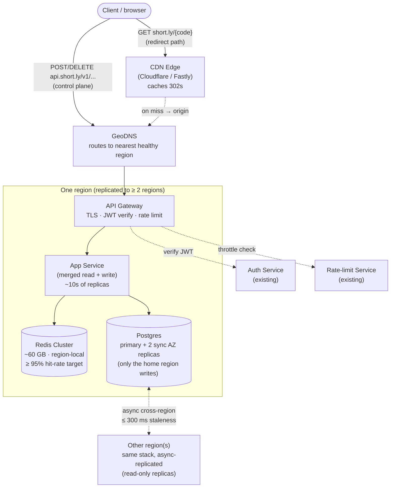

# URL Shortener

> Status: draft
> Date: 2026-05-02
> Time spent: ~0 min

This template follows the standard system-design interview arc. Each section is short on purpose — interviewers reward clarity, not volume. Fill the sections roughly in order, but it is normal to loop back (e.g., revise estimation after picking a data model).

Delete the italic guidance lines from your final writeup; they exist to remind you what each section is for.

---

## 1. Problem statement & clarifying questions

**Problem:** Design a URL shortening service (TinyURL / bit.ly–style). Given a long URL, return a short URL; visiting the short URL redirects (HTTP 301/302) to the original long URL.

**Clarifying questions (Q → A):**

- Q: What are the main use cases and who would use this?
  A: Public service. Anyone (anonymous or registered) can create and share short URLs. Typical uses: tweets/SMS where character count matters, ugly tracking URLs, QR codes. Optional accounts.
- Q: What's in scope — just creation, or full lifecycle?
  A: Creation + redirection are core. Optional TTL/expiration. Account holders can delete their own URLs. **Analytics is out of scope** for this exercise.
- Q: What's in the original URL — base URL only, or path/query params too?
  A: Any valid HTTP/HTTPS URL up to ~2 KB. Stored as an opaque string and returned verbatim on redirect; we don't parse it.
- Q: How many users will use the system?
  A: ~100M MAU; ~100M new short URLs created per month; **read/write ratio ≈ 100 : 1**; 5+ years retention; global traffic.
- Q: Do users specify their own short codes?
  A: System-generated by default. Registered users can request **custom aliases** (vanity URLs). Custom aliases share the same keyspace as system-generated codes; collision on a custom-alias request returns 409.

---

## 2. Functional requirements

**The system shall:**

1. Allow any user to submit a long URL and receive a short URL.
2. Redirect any visitor of the short URL to the original long URL.
3. Allow the creator to optionally set an expiration (TTL); after expiry, the short URL no longer redirects.
4. Allow registered users to specify a custom alias at creation time; reject with an error if the alias is already taken.
5. Allow registered users to delete short URLs they created.

**Out of scope:**

- Analytics (click counts, geographic breakdown, referrer tracking)
- Authentication service itself (assume one exists; we receive a verified user identity)
- URL safety / malware scanning
- Rate limiting and abuse prevention (acknowledged but deferred)

---

## 3. Non-functional requirements

- **Scale (target):** ~100M MAU, ~100M new URLs/month. Peak **~10K reads/sec, ~100 writes/sec** (arithmetic in §4). **Read/write ratio ≈ 100 : 1.**

- **Latency** *(asymmetric — hot path vs. cold path)*:
  - **Redirect (read): p99 ≤ 50 ms, p50 ≤ 20 ms.** This is on every clicked link and dominates user-perceived latency.
  - **Creation (write): p99 ≤ 200 ms.** Cold path; user is willing to wait briefly.

- **Availability** *(asymmetric)*:
  - **Redirect: 99.99%** (~52 min/year). Measured globally across regions.
  - **Creation: 99.9%.** Short creation outages are tolerable; redirects must keep serving.

- **Consistency:**
  - **Redirect: eventual; cross-region staleness ≤ 300 ms acceptable.** A brand-new URL may 404 in another region for a few hundred ms.
  - **Creation: read-your-writes for the creator.** After the API returns a short URL, the creator must be able to use it on the next click (e.g., via session stickiness to the home region).
  - **Custom-alias collision check: strongly consistent within a region.** Two users requesting the same alias must not both succeed.

- **Durability:**
  - **Synchronous replication to ≥ 2 replicas across ≥ 2 AZs in the home region before client ack.** Cross-region replication is asynchronous.
  - **No data loss once a 200 has been returned.** Up to ~300 ms of in-flight unacked writes may be lost in a full regional outage — accepted trade-off.

---

## 4. Capacity estimation (back-of-envelope)

**QPS**
- Reads:  avg ≈ **4K QPS**, peak ≈ **10K QPS**  (10B reads/mo ÷ 2.6M sec/mo ≈ 3.8K avg, ×2.5 peak factor)
- Writes: avg ≈ **40 QPS**,  peak ≈ **100 QPS**  (100M writes/mo ÷ 2.6M sec/mo ≈ 38 avg)

**Storage**
- Per record: **~600 B** (short_code 7 + long_url avg 500 + metadata 50)
- Per day:    3M records × 600 B ≈ **1.8 GB/day**
- 5 years:    1.8 GB × 1825 days ≈ **3.3 TB**

**Bandwidth (egress)**
- Avg:  4K reads/s × 500 B  ≈ **2 MB/s**
- Peak: 10K reads/s × 500 B ≈ **5 MB/s**

**Cache memory** *(target ~95% hit rate via LRU)*
- Hot working set ≈ **~100M most-clicked URLs at any time** (recent + currently trending — old URLs cool off fast)
- Memory: 100M × 600 B ≈ **~60 GB** — fits a single Redis cluster
- Don't pre-compute the perfect size: commit to a target hit rate and tune from measurement

**Implications**
- **Storage** (3.3 TB at 5 yrs) fits a single replicated Postgres / DynamoDB table. **No sharding required on day one**, but plan a shard key (e.g., `short_code` prefix or hash) for when growth crosses ~10 TB.
- **Read QPS** (10K peak) at a 60 GB working set is a textbook cache problem. A Redis cluster at 95% hit rate reduces DB read load to ~500 QPS — trivial.
- **Bandwidth** (5 MB/s peak) is small enough that a CDN is **not required for capacity**; it may still be motivated by *latency* for distant users (§6).
- **Write QPS** (100 peak) is tiny — a single primary handles it; no write-side sharding needed.
- The **fastest-growing resource is storage**, not request volume — revisit sharding in 2–3 years.

---

## 5. API design

**Hosts (deliberate split):**

- `https://api.short.ly/v1/...` — control plane (create / delete). JSON, auth, validation.
- `https://short.ly/{code}` — redirect plane (GET only). CDN-friendly, no auth, no JSON.

The split lets the redirect host be served from edge with aggressive caching while the API host carries the heavier middleware stack.

---

### 1. Create a short link

```
POST   https://api.short.ly/v1/shortlinks
Headers:
  Authorization: Bearer <jwt>            (optional; required if `alias` or
                                          `expiration` is set)
  Idempotency-Key: <client UUID>         (optional, recommended for retries)
Body:
  {
    url:        string    required, valid HTTP/HTTPS, ≤ 2 KB
    alias:      string    optional, 4–32 chars [a-zA-Z0-9_-]
    expiration: datetime  optional, ISO 8601, must be > now
  }
Returns 201:
  {
    code:       "abc123",
    short_url:  "https://short.ly/abc123",
    long_url:   "https://example.com/...",
    expiration: "2026-08-15T12:00:00Z" | null,
    created_at: "2026-05-03T..."
  }
Errors:
  400  url malformed / >2KB; alias malformed; expiration in past
  401  alias or expiration provided without auth
  409  alias already taken
  422  alias collides with a system-generated code (rare)
```

### 2. Redirect

```
GET https://short.ly/{code}
Returns 302 with Location: <long_url>
Errors:
  404  code unknown or expired
  410  code was deleted (optional; many systems return 404)
```

### 3. Delete a short link

```
DELETE https://api.short.ly/v1/shortlinks/{code}
Headers:
  Authorization: Bearer <jwt>   required
Returns 204 (No Content)
Errors:
  401  no/invalid token
  403  caller is not the creator
  404  code does not exist
```

---

**Auth.** JWT in `Authorization: Bearer <token>`, verified by the API gateway. Identity claims (`sub`, scopes) are attached to the request context as middleware (AuthN). Per-field permission checks (e.g., "anonymous identity cannot set `alias`") are AuthZ, evaluated in a policy layer **after** body parsing and **before** the controller — controllers stay free of auth concerns.

**Idempotency** — two distinct concepts:

- **Product-level (intentional):** submitting the same `url` twice without an `Idempotency-Key` returns **different** codes. This supports separate share contexts (matches bit.ly / TinyURL behavior). Trade-off: simpler implementation, no need for an index on `long_url`; clients lose dedup across separate creations.
- **Retry-level:** clients that pass `Idempotency-Key` get the original response on retry within a 24-hour window. Server stores `(idempotency_key → cached_response)` with a 24h TTL. Required for safe retries on network errors.

**TTL gating.** Setting `expiration` requires authentication (registered users only). Matches industry norm (TTL is typically a paid-tier feature; reduces abuse vectors). §2 has been read with this gating in mind.

---

## 6. High-level architecture

### Components (per region, replicated to ≥ 2 regions)

- **CDN edge** (Cloudflare / Fastly / CloudFront) — fronts the redirect host (`short.ly/{code}`); caches `302` responses; absorbs the bulk of read QPS without hitting origin.
- **GeoDNS** (Route 53 / similar) — routes API-host (`api.short.ly`) requests to the nearest healthy region.
- **API Gateway** — TLS termination, JWT verification (AuthN), rate-limit check, routing.
- **App Service** (merged read + write, ~10s of replicas, right-sized for the read path) — handles redirects and create/delete on the same fleet. Internal handlers separate the paths but share process and deployment.
- **Cache cluster** — Redis (clustered or Sentinel for HA), region-local, ~60 GB working set, target ≥ 95% hit rate.
- **Database** — Postgres, primary + ≥ 2 sync replicas across ≥ 2 AZs in the **home region** (= the global write primary). Other regions hold async-replicated read replicas.

### External dependencies (existing, not designed)

- **Auth Service** — issues / validates JWTs.
- **Rate-limit Service** — backs API gateway throttling.

### Multi-region topology

**Single-leader, async cross-region replicas.** One region (the *home region*) is the global write primary; all other regions hold read replicas kept up via async replication (cross-region staleness ≤ 300 ms per §3). All writes route to the home region; reads are served locally everywhere. (See `wisdom/multi-region-databases.md` for the four-topology comparison and why this one was chosen — the strong-consistency requirement on alias collision (§3) is what forces single-leader.)

### Diagram



### Read path: `GET short.ly/abc123`

1. **DNS resolution.** Browser resolves `short.ly` → returns IP of the nearest CDN edge PoP.
2. **TLS + HTTP request to CDN edge.**
3. **CDN cache lookup** (key: full URL `/abc123`).
   - **Hit (~95% of redirects):** CDN returns the cached `302` with `Location: <long_url>`. End-to-end user latency ≈ **10–30 ms**. Origin is never touched. **This single hop absorbs the bulk of the 10K read QPS.**
   - **Miss:** CDN forwards to the nearest healthy regional origin.
4. **(On miss)** Regional **App Service** handles the lookup:
   - Redis cache lookup by `code`.
     - **Hit:** return long URL.
     - **Miss:** fall through to Postgres (local read replica), then populate Redis (cache-aside).
   - Return `302` with `Location: <long_url>` and `Cache-Control: public, max-age=…` so CDN — and possibly the browser — cache the response.
5. **CDN caches the 302** and serves it back to the user.
6. **Browser follows the redirect** to the long URL.

**Latency budget (worst realistic case, miss everywhere, user near origin):**

| Hop | Approx. cost |
|---|---|
| DNS (cached locally) | ~0 ms |
| TLS to CDN edge | 5–20 ms |
| CDN miss → origin region | 10–30 ms |
| API LB → App Service | < 1 ms |
| Redis miss → Postgres replica | 1–3 ms |
| 302 back to client | 5–20 ms |
| **Total** | **~25–75 ms** |

50 ms p99 is achievable only because **most reads stop at step 3 (CDN hit)**. If half of reads went all the way to Postgres, p99 would blow through the SLO.

**Interesting design choices on this path:**

- **Negative caching** at the CDN for `404` responses with a short TTL (~30 s) — prevents a viral wrong-link from stampeding origin.
- **`302` not `301`** so we can revoke a redirect when the URL is deleted (see `wisdom/caching-layers.md` for the trade-off). `Cache-Control: max-age` is what enables CDN caching despite the `302`.
- **Explicit CDN purge on delete** — the App Service calls the CDN's purge API when a delete happens, so revoked codes go cold at the edge within seconds.

### Write path: `POST api.short.ly/v1/shortlinks`

1. **DNS resolution.** Browser resolves `api.short.ly` via **GeoDNS** → routes to the nearest healthy region's API gateway IP.
2. **TLS + HTTPS POST** to the **regional** API gateway (could be the home region or any other region).
3. **API Gateway** (in order):
   - TLS terminate.
   - Rate-limit check against the rate-limit service.
   - AuthN: if `Authorization: Bearer <jwt>` is present, verify against Auth service; attach claims (or anonymous) to the request context.
   - Forward to **regional App Service**.
4. **Regional App Service** (in order):
   - **Body validation**: parse JSON; validate `url` (HTTP/HTTPS, ≤ 2 KB), `alias` format if present, `expiration > now` if present.
   - **AuthZ policy**: if `alias` or `expiration` is set AND identity is anonymous → return `401`.
   - **Idempotency-Key check** (Redis-backed dedup store, 24 h TTL): if seen, return cached prior response and stop.
   - **Code generation** (library; full algorithm is the §8 deep-dive):
     - User-supplied `alias` → validate availability via a **strongly-consistent** insert against the home-region Postgres primary (unique constraint on `code` → `409` on conflict).
     - System-generated → 7-char base62; attempt insert; on rare collision regenerate.
   - **Postgres write to the home-region primary** — `INSERT INTO urls(code, long_url, owner_id, expiration, created_at)`. **Synchronously replicated to ≥ 2 AZ replicas in the home region before primary acks** (per §3 durability). **⚠ If the App Service is in a non-home region, this hop crosses regions — see Regional reality below.**
   - **Cache populate** (write-through to local Redis): gives **read-your-writes** for the creator on their next click.
   - **Idempotency-Key store**: cache the response under the key for 24 h.
   - Return `201` with `{code, short_url, long_url, expiration, created_at}`.
5. **Async cross-region replication** of the new row begins after primary ack — propagates to other regions' read replicas within the **≤ 300 ms staleness budget**.

#### Regional reality — cross-region write cost

The walkthrough above hides a real cost. **Writes from non-home regions cross regions to reach the primary.** For a Tokyo user writing to a `us-east-1` home region:

```
Tokyo browser → Tokyo CDN/gw       (~5 ms)
              → Tokyo App Service  (~1 ms)
              → cross-region call to us-east-1 Postgres primary
                                   ⤷ ~150 ms RTT
              → response back      (~150 ms)
              → 201 to Tokyo browser
```

That adds ~150–250 ms of inter-region RTT to the write path.

| Writer location | Approx. write latency |
|---|---|
| In home region | ~30–130 ms (well within 200 ms p99 SLO) |
| In nearby region (e.g., US ↔ EU) | ~120–250 ms (close to / over SLO) |
| In far region (e.g., US-primary ↔ Asia) | ~200–350 ms (over SLO) |

**This is the accepted trade-off of single-leader topology.** At 100 writes/sec global peak it's tolerable; if write traffic ever became globally heavy, this is the constraint that would force escalating to a globally-distributed DB (Spanner / CockroachDB / DynamoDB Global Tables) — flag for §10.

**Interesting design choices on this path:**

- **Read-your-writes for the creator** — write-through to home-region Redis gives an immediate cache hit on the creator's next click *within the home region*. Across regions, the creator may be **session-pinned to the home region** for ~1 minute via a sticky cookie, so they don't cross the 300 ms async-replication window.
- **Strong consistency only on alias collision** — leveraged by Postgres's existing unique-constraint mechanics, no new locking layer needed. Most of the system tolerates eventual consistency; **one specific operation cannot.**
- **Idempotency-Key store** is a separate Redis namespace from the URL cache, with its own TTL — keeps concerns clean.

### Deferred to deep-dives (§8)

- **Short-code generation algorithm** (counter vs. hash vs. pre-allocated ranges; collision handling at scale)
- **Cache-aside details** (read-through vs. write-through; thundering-herd protection on cold cache; invalidation on delete)
- **Custom-alias collision under concurrent writers** (relies on DB unique constraint, but how exactly)

### Load-bearing operational assumptions

- Modern CI/CD with canary deploys, automatic rollback, and feature flags. (This is what justifies merging read and write into one service rather than splitting for blast-radius isolation. See `wisdom/interview-meta.md`.)
- Managed CDN (Cloudflare / Fastly) and managed GeoDNS (Route 53) — we do not run them.
- Existing Auth and Rate-limit services with sub-20 ms response times under load.

---

## 7. Data model

### Database choice — PostgreSQL (relational)

- **Strong-consistency requirement on alias-collision** (§3) is satisfied by Postgres's unique constraint with no extra coordination layer.
- **Single-leader topology** (§6) is exactly Postgres's native replication model.
- **Write rate** (~100 QPS peak) is well within a single primary.
- **Why not NoSQL?** DynamoDB / Cassandra require conditional writes plus app-level retry to express *first-writer-wins on a unique field* — more operational complexity for no benefit at this scale. Worth re-evaluating only if write rate grows by 100×.

### Primary table

```
Table: shortlinks
  code         varchar(32)   PK            -- 7 chars for system-generated, up to 32 for custom aliases
  long_url     varchar(2048) NOT NULL      -- per §1, max 2 KB
  creator      uuid          NULL          -- NULL = anonymous create; type matches Auth service's user_id
  expiration   timestamptz   NULL          -- NULL = no TTL; UTC under the hood
  created_at   timestamptz   NOT NULL DEFAULT now()
```

### Indexes

- **PK on (`code`)** — covers redirect lookup, delete-by-code, alias-collision check. *Every* query in §5 lands on this.
- **No other indexes for now.** A `creator` index would be required only when "list my URLs" is added — deferred since it's not in §2.

### Shard key (deferred, future)

**`hash(code)`** — every read and write specifies `code`, so hash-partitioning routes cleanly with no fan-out and no cross-shard transactions. Per §4, introduce when storage approaches ~10 TB. Range-partitioning on `code` would be worse (potential hotspot on the most-recent range if generation is sequential).

### Deletion strategy — hard delete

- No audit / history requirement (§1 places this out of scope).
- 404 vs 410 distinction is not load-bearing for our consumers; both signal "code not usable".
- Avoids unbounded growth from tombstone rows over a 5-year retention window.

### Idempotency-Key store (Redis, separate namespace)

- **Key:** `idem:{sha256(api_token)}:{idempotency_key}`
- **Value:** serialized response body + status code
- **TTL:** 24 hours
- **Why hash the token?** Avoids storing raw bearer tokens in cache values (defense in depth against a Redis dump leaking credentials).
- **Why namespace by token?** Different clients accidentally colliding on the same UUID must NOT share dedup state.

### Per-row size sanity check

```
code        ~10 B  (avg over system + custom)
long_url   ~500 B  (per §4 estimate)
creator     16 B   (binary UUID; mostly populated)
expiration   8 B   (mostly NULL → near-zero stored cost)
created_at   8 B
row overhead ~60 B (Postgres tuple header + alignment + null bitmap)
─────────────────────
total      ~600 B  → matches §4 capacity estimate ✓
```

---

## 8. Deep dives

*Pick 1–2 subsystems with the most interesting trade-offs and go one level deeper. This is where senior signal lives. Examples: ID generation strategy, cache invalidation, sharding scheme, hot-key handling, async pipeline, failure recovery.*

### 8.1 Custom-alias collision under concurrent writers

#### Problem

Two writers concurrently submit `POST /shortlinks` with the same `alias`. Guarantee: **exactly one wins (201), the other gets 409 Conflict. Never both win, never both lose.**

Because of §6's single-leader topology, both requests funnel to the home-region Postgres primary, so this collapses to a single-region concurrency problem.

#### Algorithm

Single-statement INSERT, relying on the PK unique index for serialization:

```sql
INSERT INTO shortlinks (code, long_url, creator, expiration, created_at)
VALUES ($1, $2, $3, $4, now())
RETURNING code, created_at;

-- on error 23505 (unique_violation) → return 409 Conflict
```

No `SELECT`-then-`INSERT` (TOCTOU race). No application-level lock. The unique index *is* the lock.

#### Why the unique index is the right primitive

- Operates at the **B-tree storage layer**, independent of MVCC isolation level. Even at READ UNCOMMITTED, uniqueness would still be enforced — the unique-index mechanism is below MVCC.
- When TX2's INSERT collides with an in-flight TX1, TX2 **blocks on TX1's outcome**, then either fails (TX1 committed → `23505`) or succeeds (TX1 aborted).
- Atomic, single round-trip, no extra infrastructure.

**Alternatives considered:**

- **TOCTOU `SELECT`-then-`INSERT`** — race-prone; both writers can read "no row exists" before either inserts. Would need a pessimistic lock or distributed coordination layer to fix.
- **Pessimistic lock (`SELECT ... FOR UPDATE` on a non-existent row)** — works via gap locks but adds deadlock surface for no benefit.
- **Distributed lock via Redis `SET NX`** — extra moving part for a problem the DB already solves atomically.

The unique index gives us serialization for free; reaching for any of the alternatives is a smell.

#### Validation (before INSERT)

- **Reserved aliases** rejected via app-level config-driven blocklist: `admin`, `login`, `api`, `v1`, `health`, `static`, `auth`, `signup`, etc. **Not a CHECK constraint** — list changes shouldn't require migrations.
- **Format check**: 4–32 chars, `[a-zA-Z0-9_-]` (per §5).
- **Case folding**: aliases are **case-insensitive**. `Team-Offsite` and `team-offsite` are the same resource. Lowercase at the API layer, store lowercased; the unique constraint enforces uniqueness on the lowercased form. (Postgres alternative: `CITEXT` column type.)

Reasoning: users get confused if `MyLink` exists but `mylink` appears available. Browsers and copy-paste handle case unpredictably. Case-insensitive is the safer default for user-facing identifiers.

#### Cross-keyspace collision

Custom aliases and system-generated codes **share the same `code` column** → same unique index handles both. A custom-alias request for a 7-char base62 string that happens to match an existing system-generated code returns 409 via the same path. Inverse: when generating a system code, the same INSERT-and-handle-violation pattern catches collisions with existing custom aliases.

No special-case logic; same primitive both ways.

#### Failure modes & retry safety

| Failure | What the client sees | Safe to retry? |
|---|---|---|
| Constraint violation (`23505`) | `409 Conflict` | **No** — alias is taken; will keep failing. Client picks a different alias. |
| Network drop mid-INSERT | Connection error, no response | **Only with `Idempotency-Key`.** Without it, the client cannot distinguish "didn't happen" from "happened but ACK lost." |
| Primary failover during INSERT | `5xx` | **Only with `Idempotency-Key`.** In-flight uncommitted transactions are aborted; sync-replicated committed writes survive (§3 durability). |

**This is exactly why `Idempotency-Key` is in §5/§6.** The unique index alone is not enough for retry safety — the *client side* of the retry needs application-layer dedup. The Idempotency-Key store (Redis, 24 h TTL) returns the cached prior response on retry, so the second attempt becomes a no-op rather than a duplicate or a confusing 409.

#### Performance under contention

- **Failed INSERTs are sub-ms.** Postgres detects the violation at the index lookup; no row written. 1000 failed inserts/sec ≈ 1 s of DB CPU — trivial.
- **Legitimate writes don't contend with each other** — different aliases hit different B-tree leaves; no waiter queue.
- **Same-alias contention is by design**: serialize, fast 409 for losers, no blocking on unrelated writers.
- **Bot squatting** (mass-claiming popular aliases) is bounded by **API-gateway rate limit** before requests reach the DB. Custom-alias path also requires auth, raising the bar further.
- **Single-primary write ceiling** (~thousands of QPS for a well-tuned Postgres on commodity hardware) is the eventual hard limit. At 100 QPS peak we have ~10×–100× headroom.

#### Cross-region consistency (brief)

After commit at the home-region primary, async replication propagates the row to other regions within ≤ 300 ms (§3 budget). The creator is session-pinned to the home region for ~1 minute (§6) so their own next click is served by primary-region replicas — they cannot observe the replication-lag 404. External users (someone the creator immediately shares the link with) **may see a brief 404** in the few hundred ms after creation; accepted trade-off.

#### Honest remaining failure modes

- **Sustained primary-region outage**: writes globally unavailable until failover promotes a replica. Read path keeps serving from CDN + cross-region replicas → redirect SLO survives, but new shortlink creation pauses. Recovery is operational (failover automation, drilled), not a design fix at this layer. Flagged for §10.
- **Coordinated takeover attack on a soon-to-trend alias**: only rate limit + auth between attacker and the DB. Could harden with CAPTCHAs or per-IP/per-user concurrency limits if abuse becomes real. Flagged for §10.

---

### 8.2 Short-code generation

#### Problem

A user submits `POST /shortlinks` with no `alias`. The system must mint a 7-char base62 code that is:

- Unique across the table (no collision with system-generated codes or custom aliases).
- Cheap to produce at 100 writes/sec global peak (and capable of scaling further).
- Hard to enumerate — an attacker who knows code `aB3xK9` should not be able to easily guess other valid codes, otherwise they can crawl every URL ever shortened.

#### Algorithm — random + retry on conflict

```python
MAX_RETRIES = 10
CODE_LENGTH = 7   # feature-flagged; lengthen to 12 when retry-rate climbs (see Saturation)

def create_short_code(long_url, creator, expiration):
    for attempt in range(MAX_RETRIES):
        code = secrets.token_urlsafe_base62(CODE_LENGTH)   # CSPRNG, see below
        if code.lower() in RESERVED_WORDS:
            continue   # treat as a soft collision; regenerate
        try:
            db.execute("""
                INSERT INTO shortlinks (code, long_url, creator, expiration, created_at)
                VALUES ($1, $2, $3, $4, now())
                RETURNING code, created_at
            """, code, long_url, creator, expiration)
            metrics.increment("shortcode.attempt_succeeded", tags={"retries": attempt})
            return code
        except UniqueViolationError:
            metrics.increment("shortcode.collision_retry", tags={"attempt": attempt})
            continue

    # exhausted — should not happen at our scale; signals saturation or bug
    metrics.increment("shortcode.exhausted")
    log.error("shortcode generation exhausted retries", url=long_url)
    raise InternalServerError(500, "could not allocate code; please retry")
```

**Why this shape:**

- **Random + retry** beats counter-based (predictable → enumerable, see Predictability) and beats hash-of-URL (deterministic → contradicts §5's "same URL → different codes" decision; also leaks URL existence to anyone who can hash).
- **Bounded retry loop** — never `while true`. At our scale, exhaustion shouldn't happen; if it does, that's a signal (saturation or generator bug), not a normal failure.
- **`500 Internal Server Error`** on exhaustion (not `5xx` generically; not `503` since client retry won't help).
- **CSPRNG, not naive `Random()`.** Use `secrets` (Python), `SecureRandom` (Java), `crypto.randomBytes` (Node), `crypto/rand` (Go). A non-cryptographic PRNG is seeded predictably and lets attackers infer future codes from observed ones — collapsing the "unenumerable" property the algorithm depends on.

#### Math at our scale

Keyspace: 62⁷ ≈ 3.5 × 10¹². Lifetime rows (5 yrs × 100M/mo): ~6 × 10⁹.

| Quantity | Value | Implication |
|---|---|---|
| Fill ratio at 5-year horizon | **~0.17%** | barely scratched |
| Per-insert collision probability | **~0.17%** (≈ fill ratio at low fills) | 1 in 600 inserts hits a retry |
| Expected retries per insert | **~0.0017** | effectively zero overhead |
| Probability of needing 2+ retries | **~3 × 10⁻⁶** | practically never |
| Probability of exhausting 10 retries | **~2 × 10⁻²⁸** | will not happen; if it does → alert |

The retry loop is mathematically a no-op at this fill ratio. It exists for the rare collisions that *do* occur, and as a defensive guard against bugs and unexpected saturation.

#### Predictability — why random over a counter

A counter-based scheme (`base62(monotonic_counter)`) is collision-free by construction and slightly simpler. **It's wrong for a public URL shortener** because:

> Predictable codes turn an unenumerable namespace into an enumerable one.

With predictable codes, an attacker can:

- **Enumerate every URL ever shortened.** Iterate the counter range, hit each redirect, log every long URL.
- **Estimate traffic** — count of codes between two known timestamps tells the system's write rate.
- **Discover "private" links.** Users sometimes treat short links as quasi-secret ("only people I share this with should see this"). Predictability silently invalidates that.

This is not theoretical — Snapchat (early), several internal corporate shorteners, and Google Docs share-link variants have all leaked content this way.

With random + 7-char base62 (CSPRNG-generated):

```
miss rate when guessing a random code at our fill ratio ≈ 99.83%
brute-force enumeration cost = ~3.5 × 10¹² probes
                              ≈ 110 years at 1000 probes/sec (rate-limited well below this)
```

Counter-based ID generation **is** appropriate for **internal IDs that never leak to clients** (e.g., DB auto-increment PKs; Snowflake IDs for internal logging). It's only wrong when the counter value is the public artifact. Hybrid approaches (Hashids / Sqids — encrypted counter that looks random) preserve sequential B-tree locality at the cost of a key-management concern; not worth it for URL shortener at this scale.

#### Keyspace saturation — when 7 chars stops being enough

**Trigger from a metric, not from a row count.** When `shortcode.collision_retry / total_inserts` climbs above ~1% (corresponding to ~1% fill ratio, ~35B rows), start the migration. That gives decades of lead time at our growth rate.

| Fill | Per-insert collision rate | P(needing 10 retries) | Operational impact |
|---|---|---|---|
| 0.17% (today, 6B rows) | 0.17% | ~10⁻²⁸ | invisible |
| 10% (350B rows) | 10% | ~10⁻¹⁰ | invisible |
| 30% | 30% | ~6 × 10⁻⁶ | rare 500s |
| 50% | 50% | ~0.1% | 1-in-1000 inserts fails |
| 80% | 80% | ~10.7% | **meltdown** — 10% of writes return 500 |

Waiting until literal exhaustion is far too late. The system breaks under retry pressure long before keyspace fills.

**Migration: don't migrate. Just lengthen new codes.**

```python
CODE_LENGTH = 7    # before
CODE_LENGTH = 12   # after — flipped via feature flag, coordinated rollout
```

- **Old codes (7 chars) stay 7 chars forever.** Every short URL ever shared in the wild keeps redirecting. Mutating existing codes (e.g., adding a prefix to migrate them) would 404 every shared link — catastrophic violation of the implicit "this URL works forever" product contract.
- **New codes (12 chars) issued going forward.** New keyspace is 62¹² ≈ 3.2 × 10²¹ — effectively infinite.
- **Lookup is unchanged.** `WHERE code = $1` works for any length up to `varchar(32)`.
- **No schema migration.** §7's `varchar(32)` PK column already accepts both lengths.
- **Coordinated rollout.** Feature-flag the length so all writers flip simultaneously — otherwise a brief window of mixed-length writers could spike retry rates against the increasingly-saturated 7-char space.

The two keyspaces are **disjoint by length**, so collisions between old and new codes are impossible. The same unique index protects both.

#### Composition with §8.1's custom-alias path

**Same keyspace, same unique index, same error path — no special composition logic needed.** Both system-generated codes and custom aliases land in the same `code` column, serialized by the same PK constraint, returning `409` (custom-alias) or triggering retry (system-generated) on `23505`.

Two small consequences worth stating:

- **The reserved-words blocklist applies to both paths.** A random generator can in principle output `admin` / `login` / `health`. Treat as a soft collision and regenerate (see the algorithm above). Otherwise we'd issue a reserved word as a system code, breaking the same invariant we protect on the custom-alias path.
- **Profanity filtering** (a random 7-char string can occasionally spell something offensive) is an optional product polish item. Most production shorteners apply a dictionary check before issuing. Not load-bearing for the architecture; flagged for §10.

The shared keyspace is a **deliberate** simplification — separating into two namespaces (e.g., system codes always start with `s_`) would add table/index/validation complexity for negligible benefit.

#### Honest remaining concerns

- **CSPRNG is required.** A naive `Random()` would let an attacker predict future codes from observed ones. Stated explicitly in the implementation; not enforceable from the design alone.
- **Retry-rate metric must be exported and alertable.** The migration plan depends on it. If observability fails, the system silently drifts toward saturation.
- **Profanity filter** is left out of v1. Not a system-design concern but a product one.

---

## 9. Bottlenecks, trade-offs, and what would break first

### What breaks first under 10× load

**Interview-time summary (3 sentences):**

1. Reads at 10× are mostly absorbed by the CDN and the in-region cache hierarchy — origin and DB read replicas barely feel the pressure.
2. The single-primary write path is the architectural choke point, but at 1K writes/sec it's still in headroom; the **real discomfort at 10× is the cross-region write latency tail**, where more writers cross 150–300 ms to reach the home region and the 200 ms p99 creation SLO gets tight.
3. The architectural ceiling is at **~50–100× writes (~10K QPS)**, where single-primary capacity forces migration off single-leader to a sharded or globally-distributed DB (Spanner / CockroachDB).

### Component-by-component headroom check at 10× (100K read QPS, 1K write QPS)

| Component | Load at 10× | Headroom |
|---|---|---|
| **CDN edge** | 100K read QPS, ~95% hit rate | Trivial. CDNs scale to millions of QPS by design. |
| **GeoDNS / origin LB** | Negligible per-request (post-DNS-cache) | Trivial. |
| **Origin App Service (post-CDN)** | ~5K read QPS + 1K write QPS, distributed across ~10s of replicas | ~600 QPS per replica; comfortable. |
| **Redis cache** | ~5K read QPS post-CDN-miss + 1K write-through | Redis handles 100K+ ops/sec. Trivial. |
| **DB read replica (in-region)** | ~250 read QPS (the few cache misses) | Trivial — replicas are mostly idle. |
| **DB single primary (writes)** | 1K write QPS, sync 2-AZ replication | Postgres on commodity HW handles 5–10K writes/sec; **in headroom but visibly working harder**. |
| **Cross-region write path** | Same per-writer 150–300 ms tail, 10× more writers paying it | **The actual pressure point** — distribution shape pushes more of the curve into the p99 tail. |

### What gets uncomfortable but doesn't break

- **Cross-region write latency tail.** 10× more writers feeling 150–300 ms to reach the home-region primary. Our 200 ms p99 creation SLO becomes harder to defend. Mitigations: route the writer's region selection by user home region (where possible); accept the SLO degradation in the asia-from-us-primary tail and document it.
- **Cache working set drift.** If 10× growth flattens the popularity distribution (less Zipfian), the 60 GB working set may need expansion. Detected from cache hit-rate metric, not predictable from load growth alone.
- **Single-primary write-side observability burden.** At 1K QPS the primary is fine but no longer "boring" — replication lag, WAL pressure, and connection-pool saturation become things to watch closely. Operational tax of approaching the ceiling, not a break.

### Architectural ceiling at ~50–100× writes (~10K QPS)

This is the load level that forces the **next topology**:

- **Sharded by `code`** (single-leader-per-shard) — already named as the deferred shard key in §7. Each shard has its own primary; writes route by `hash(code)`. Strong-consistency on alias collision is preserved per-shard. Operationally heavier (multiple primaries, multiple failover stories, hot-shard risk).
- **Globally-distributed DB** (Spanner / CockroachDB / DynamoDB Global Tables) — clean abstraction; some give strong consistency globally. Cost goes up significantly; cross-region writes still pay physics; operational expertise rare. See `wisdom/multi-region-databases.md`.

The order of preference if forced off single-leader: **sharded by code** for cost, **globally-distributed** for operational simplicity (assuming the budget). Either is a 12–18 month project, not a fire drill — flagged for §10.

### Trade-offs taken — what we gave up to get this design

Each trade-off below is stated as **chose X** / **paid Y** / **accepted because Z**. The senior framing always names what the *alternative* would have cost, not just what we did.

#### 1. PostgreSQL (relational) over NoSQL

- **Cost paid:** harder horizontal write-scaling. A single Postgres primary tops out at ~5–10K writes/sec. NoSQL stores (DynamoDB, Cassandra) scale write throughput by adding nodes; Postgres requires sharding (significant operational complexity).
- **Why we paid:** **transactional unique-constraint enforcement** on alias collision (§3 strong-consistency commitment). Postgres gives us this trivially via the unique index. NoSQL stores require conditional writes plus app-level retry logic to express "first-writer-wins on a unique field" — same correctness, more code, more failure modes. At 100 writes/sec we're nowhere near the single-primary ceiling, so the write-scaling cost is hypothetical for now. **If write rate ever crossed ~10× our current peak, we'd revisit.**

#### 2. Eventual cross-region consistency over synchronous global consistency

- **Cost paid:** brief cross-region 404 window (≤ 300 ms) when a creator immediately shares a freshly-created link with someone in a different region. The recipient may see "code not found" until async replication closes the gap.
- **Why we paid:** the alternative — **synchronous cross-region replication** — would add ~100–300 ms to every write commit, globally and always. That makes the 200 ms creation p99 essentially unachievable. We chose to push the cost into a rare edge case (cross-region recipient clicking within the first 300 ms) instead of putting it on the steady-state critical path of every write. **The creator themselves don't see the 404** thanks to session-pinning to the home region + write-through cache populating the new code in the local Redis.

#### 3. Merged read+write service over split services

- **Cost paid:** **deploy blast radius**. Write-path code lives on the same fleet as the hot redirect path. A bad write-side deploy or runtime regression can hurt redirect availability (10K QPS, 99.99% SLO) even though the read code didn't change.
- **Why we paid:** modern CI/CD (canary deploys, automatic rollback, feature flags — the load-bearing operational assumption from §6) handles blast radius in software rather than in topology. The operational savings of one service over two (single deploy pipeline, single dashboard, single on-call surface) outweigh the marginal isolation benefit at our write rate. **Splitting becomes the right call** only when our deploy maturity is low, when write-fleet operational profile genuinely diverges (different instance types, security boundaries, scale shape), or at much higher write QPS. The 100:1 read/write ratio is what makes the merged design work; it's a consequence of the choice, not the justification for it.

#### Trade-offs deferred for §10

Three more deliberate trades that aren't fully discussed here but are baked into the design — flagged for the follow-up section:

- **302 over 301** — paid in per-click round trip; got revocability and per-click analytics potential.
- **Hard delete over soft delete** — paid in lost audit/restore; got bounded storage growth.
- **Random codes over counter-based** — paid in rare retries; got unenumerable namespace.

---

## 10. Follow-ups / what I would do with more time

Most of the items below were flagged inline as we built the design. §10 is consolidation, not invention. Items are ranked by **likelihood of causing a real production incident if ignored**.

### High-priority (operational risks)

1. **Multi-region failover drill — quarterly.** §3 commits to 99.99% redirect availability and "no data loss after ack" (sync 2-AZ replication). That commitment is only real if failover works under pressure. Run a quarterly chaos drill: simulate home-region outage, measure RTO/RPO, validate the cross-region promotion runbook end-to-end.
2. **Retry-rate metric + saturation alerting.** §8.2's trigger for the 7→12 char code-length migration is `shortcode.collision_retry / total_inserts > 1%`. Wire the metric, set the alert threshold, and verify pagerduty routing — the entire saturation-migration plan depends on observability working.
3. **CDN purge on delete — runbook + monitoring.** §6's read path assumes prompt CDN invalidation when a URL is deleted, so revoked links go cold at the edge within seconds. Verify the purge API is wired, monitor for purge failures, and exercise it in chaos testing.
4. **Idempotency-Key store HA.** The dedup store lives in Redis; if Redis fails, retries become unsafe (clients can't safely retry POSTs). Either replicate the dedup store or explicitly choose and document brief retry-unsafety during Redis incidents.

### Medium-priority (security, abuse, scale)

5. **URL safety / malware scanning.** Out of scope for v1 but a real abuse pattern at production scale — phishing campaigns and malware redirects exploit shorteners constantly. Integrate with a third-party safety service (Google Safe Browsing or similar) on the create path; soft-block links flagged after creation.
6. **Coordinated takeover / squatting defense for trending aliases.** Today's protection is rate-limit + auth. Add CAPTCHAs or per-IP / per-user concurrency limits if alias-squatting becomes a real attack pattern.
7. **Migration off single-leader topology.** §9 names this as the architectural ceiling at ~50–100× writes (~10K QPS). Either shard by `hash(code)` (cheaper, more operational complexity) or migrate to a globally-distributed DB (Spanner / CockroachDB / DynamoDB Global Tables — see `wisdom/multi-region-databases.md`). 12–18 month project — start planning when retry-rate or write-side CPU cross 50% utilization, not when they saturate.

### Considered and consciously deferred

The following were considered but cut from the priority list — flagged here so the gap is visible:

- **Analytics pipeline** (click counts, geo, referrer). Out of scope per §1; the obvious next product feature. Async fork off the redirect path → Kafka → ClickHouse / equivalent. Designed to not impact redirect SLO (best-effort, drop on backpressure).
- **List-my-URLs** for registered users. Requires an index on `creator` (deferred in §7). Add the index when this feature ships.
- **Custom domains** (`mybrand.short.ly`). Premium / commercial feature; adds domain-routing layer + SSL cert management. Non-trivial but a known commercial differentiator.
- **Profanity filter** for system-generated codes. Random 7-char strings can occasionally spell something offensive. Dictionary check before issuing.
- **CDN egress cost monitoring.** At 10× traffic the CDN bill scales linearly. Tag URLs by tier or abuse signal so high-cost / low-value traffic can be throttled.
- **Read-after-write across creator's devices** within the cross-region replication window. Today's session-pinning protects single-device flows; a creator switching devices in the first minute may briefly hit a stale replica. Mitigation: longer cache TTL on creator's user_id namespace, or sync-push new codes to all regional caches on create.
